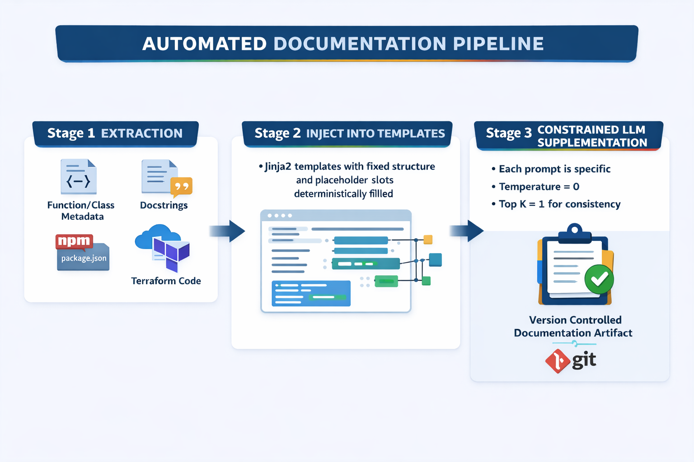

# How to document your software like a boss

**TLDR:** Everyone's documentation is always out of date and throwing Generative AI LLMs at the problem can help, but introduces non-determinism. Run the same documentation generator twice, get different documentation. That's not acceptable for enterprise systems - and good luck passing your next internal audit with that approach where you can't separate hallucinations from fact. The solution? A hybrid approach that treats LLMs as gap-fillers, not authors. The result: documentation that's 80% deterministic, 20% LLM-enhanced, and 100% auditable.

---

I've spent more than two decades helping enterprises modernise their technology architecture and software development practices. When I look back at my career, whether I was leading the Open Banking API team at HSBC, leading an IT team at Credit Suisse (now UBS), or helping a JP Morgan CTO as a Solutions Architect at Amazon, I found that one constant remained: Documentation is always outdated. *Always*. Whenever I would go to an application team and ask them if they could share their architecture what I got was a lot of uncomfortable smiles and some outdated diagrams produced by someone who had left the company a year ago.

To be fair, the information I needed did exist *somewhere*. I could eventually piece together the entire picture of their app by studying Confluence pages edited six months ago, combined with some updates I got over email, and cross-referencing that with README files that nobody remembered to update, and then trying to understand architecture diagrams that reflected the system as it was three sprints ago.

Does that sound familiar? The truth is: **if your documentation isn't generated from your source code, it might as well be fiction.**

## The Promise and Problem of LLM-Powered Documentation

The obvious solution seems to be throwing an LLM at the problem. Feed it your codebase, ask it to write documentation. Easy, right? And for personal projects or quick prototypes, that works well enough.

But try this in an enterprise context and you'll hit a wall: **non-determinism**.

Run the same LLM documentation pipeline twice. You'll get different output. Different word choices. Different sentence structures. Sometimes different interpretations of what a function actually does. Now imagine this in a regulated environment where documentation is subject to audit and any changes will have to be tracked and explained.

"Oh but we can link back to the references that the LLM uses to fact check the docs", you say? But which version goes into your compliance records? Which version do you diff against to see what actually changed? How do you trust documentation when every iteration could have been derived from a different LLM and from a different set of files?

This isn't a hypothetical problem. I've watched teams abandon LLM documentation experiments specifically because they couldn't achieve the reproducibility their governance required.

## The Deterministic-First Approach

The breakthrough comes from flipping the mental model. Instead of asking "how can we make LLM output more consistent?", ask: **"what can we extract without an LLM at all?"**

The answer is: far more than you'd think.

Consider what's already present in your codebase, waiting to be extracted deterministically:

Your **project structure** is a tree of directories and files. That's pure data. Your **function signatures**;method names, parameter types, return types;are available through Abstract Syntax Tree parsing. Existing **docstrings and comments** can be extracted verbatim. Your **architecture** can be inferred from Infrastructure as Code. Your **tech stack** is declared in package.json, requirements.txt, go.mod, and similar dependency files.

You have a goldmine of information and none of this requires an LLM. It requires parsers. And parsers are deterministic.

## The Toolchain

Making this work requires orchestrating several tools, each handling what it does best.

**For architecture diagrams**, tools like [Terravision](https://github.com/patrickchugh/terravision) (shameless plug, I wrote that) parse your Terraform code and generate accurate infrastructure diagrams. No guessing about which services connect to which and whether it matches production or not. The IaC scripts are the source of truth.

**For codebase analysis**, [Repomix](https://repomix.com/) is a tool that packs your entire repository into a structured format optimised for LLM analysis. But here's the key: you don't want to be sending this directly to an LLM for interpretation. You're going to be extracting the deterministic metadata first, and only sending the gaps.

**For tech stack detection**, dependency scanning tools like [Syft]( https://github.com/anchore/syft) and AST parsers can identify every framework, library, and language version in use. This forms the foundation of your technical documentation.

**For the template**, [Jinja2]( https://pypi.org/project/Jinja2/) provides deterministic structure. Your documentation always has the same sections, the same headings, the same format. The LLM fills slots within this structure it doesn't create the structure.

**For publishing**, CI/CD pipelines using Jenkins or GitHub Actions push the generated documentation directly to Confluence or SharePoint. Documentation updates become part of your deployment process, not an afterthought.

## Pipeline Architecture

The I've been refining a pipeline script that follows a specific sequence, visualised below:

 

If you are interested to see some sample code of how this works in practice, check out my example script on [GitHub](http://www.github.com/patrickchugh/ucd) for the actual logic. It's just an MVP script, but in production you'd expand the LLM stage with proper API calls and validation. The structure remains: extract first, template second, LLM last.

## Practical Considerations

There are genuine challenges with this approach that deserve acknowledgment.

**AST parsing across polyglot repositories** requires investment. You'll need parsers for each language, and they need to produce a common metadata format. This is engineering work, not magic.

**Template design matters enormously.** A poor template produces poor documentation regardless of how accurate your extraction is. Budget time for template iteration.

**LLM costs can accumulate** even with a minimised LLM layer. If you're using OpenAI's GPT or Claude via AWS Bedrock you could be quickly burning through tokens in no time. Batch your gaps efficiently. Consider running a local LLM via Ollama so your costs are fixed and keeping documentation generation on pull requests to main only, not every commit.

**The privacy angle:** Some security teams at your company may feel uncomfortable with the 'crown jewels' of the company's source code being sent to a third-party model or cloud provider for analysis. Considering hardware costs are always falling and GPUs and AI accelerators are now common even in laptops, running a local LLM via Ollama on your own hardware may not seem as crazy as it used to be.

**The "80% deterministic" figure will vary** by codebase. Well-documented codebases might hit 95% deterministic. Poorly-documented legacy systems might struggle to reach 60%. The approach scales, but your mileage will genuinely vary.

## The Governance Angle

For enterprises subject to regulatory requirements, this approach offers something valuable: **an audit trail**.

Your documentation is generated from code. The generation process is deterministic (or near-deterministic with prompted LLM constraints like telling it not to guess if it can't prove anything and hyperparamater settings via temperature, Top-K parameters etc). The output is version-controlled. You can prove that documentation version X was generated from code version Y on date Z.

This matters for compliance frameworks like SOX, MiFID II, and DORA that require demonstrable traceability between systems and their documentation. When the auditors come knocking, you can point to a pipeline;not a wiki page last edited by someone who left the company.

This isn't possible with manually-maintained documentation. It's barely possible with unconstrained LLM generation. But a deterministic-first pipeline provides the traceability that compliance teams will love you for.

## The Bigger Picture: Documentation as Enterprise Intelligence

Here's where it gets interesting. In a previous post, I wrote about Specification-Driven Development (SDD);the idea that specifications should generate code, not merely guide it. At first glance, that seems to contradict what I'm arguing here. If specs generate code, why do we need code to generate docs?

The answer is that they're two halves of the same cycle.

**SDD works when you're building new systems or new features.** You start with precise specifications, and AI generates implementations. The spec is the source of truth and code is its expression. But what about the millions of lines of legacy code that already exist? What about the systems built before SDD was feasible? What about the inevitable drift that occurs when production realities force changes that don't flow back through the spec?

**Deterministic documentation works when you're understanding existing systems.** It extracts truth from reality; capturing what the code actually does, what the infrastructure actually looks like, what dependencies actually exist.

The virtuous cycle looks like this: 

1. Deterministic documentation captures the current state of your systems with forensic accuracy. That documentation then becomes the foundation for SDD-style generation of new features, refactors, or even complete rewrites. 

2. The new code gets generated automatically, and then documented automatically, which feeds back into the knowledge base.

3. The Knowledge base then feeds back into documentation in Step 1.
   
   
   
   This is what Amazon's Jeff Bezos calls 'the flywheel effect' where interconnected elements build on each other, gaining speed and becoming unstoppable over time.

**This is how you build enterprise tribal knowledge that actually scales.**

Think about what happens when documentation is always accurate and always current:

Your AI coding assistants stop hallucinating about your codebase because they're grounded in documentation that reflects reality. Your autonomous agents can reason about your systems because they have reliable context to work with. Your RAG pipelines return useful results because the documents they search aren't six months stale.

New engineers onboard faster because the documentation they read matches the code they're debugging. Knowledge doesn't walk out the door when senior developers leave;it's captured in the pipeline outputs. Cross-team dependencies become visible because the documentation reveals them automatically.

This isn't just about compliance anymore. It's about building an organisational memory that compounds over time rather than decays. Documentation becomes the substrate on which your entire AI strategy runs;from coding copilots to autonomous agents to intelligent search. Without accurate documentation, you're building AI on quicksand.

## Where This Is Heading

The tooling for deterministic documentation extraction is here already and maturing rapidly. AST parsers exist for every major language. Infrastructure-as-Code tools are increasingly self-documenting. Dependency scanning is a solved problem.

What's emerging is a best practice: **treat documentation as a build artifact with the same reverence as your code**. It should be generated, versioned, and published through the same pipelines as your application code. LLMs accelerate this by filling gaps, but the foundation must be deterministic.

The end state is documentation that's never more than one deployment behind reality. Not because someone remembered to update a wiki page, but because the pipeline **ensures it**.

That's the difference between documentation as a chore and getting your documentation done like a boss.

---

*Patrick Chugh is an AWS cloud architect specialising in financial enterprise systems and has held senior leadership roles at HSBC, AWS, and Credit Suisse. As a consultant, he has advised C-level leadership at JP Morgan, Santander, and Barclays. He's the creator of Terravision, an open-source tool for generating architecture diagrams from Terraform code.*
